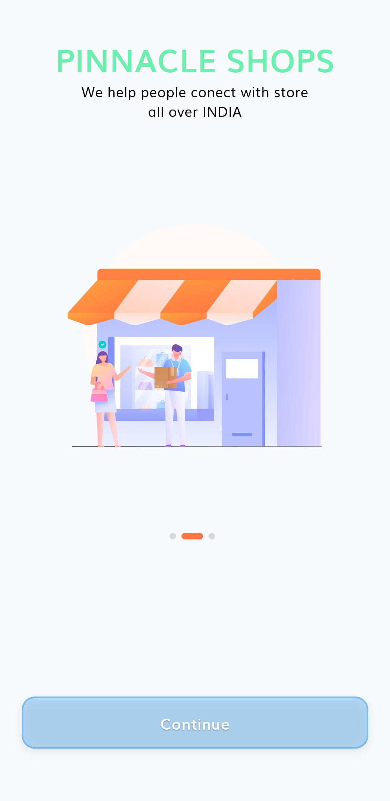
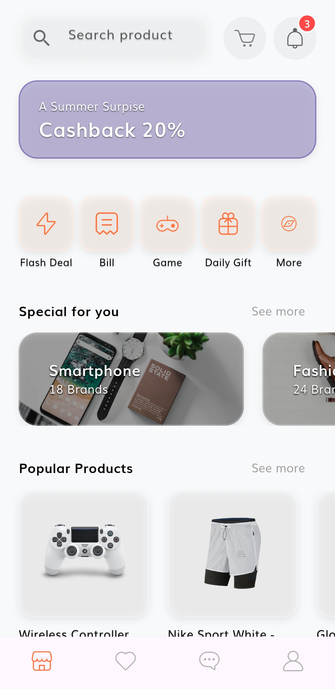
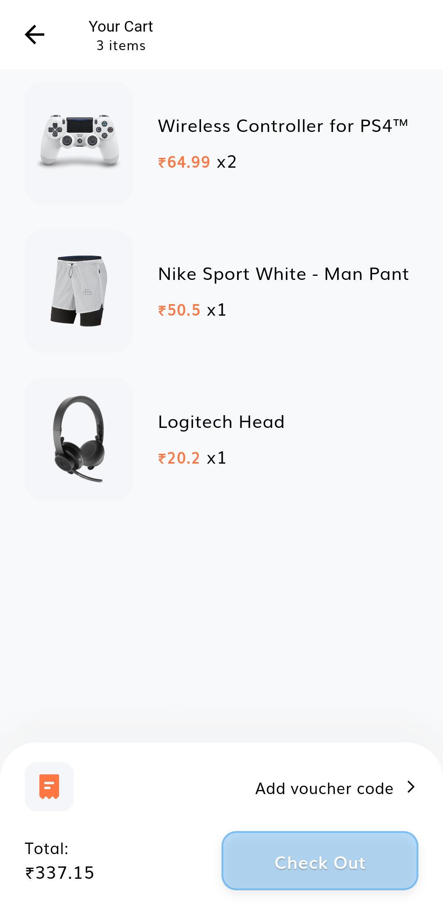
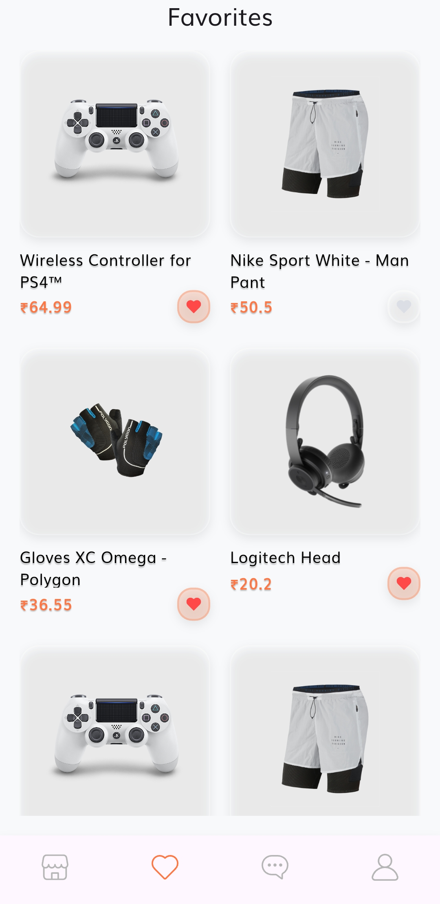

# 🛒 Flutter E-Commerce App

A modern, full-featured **Flutter-based e-commerce application** built as part of the **Pinnacle Internship** project.  
The app delivers a smooth and responsive UI, secure authentication using **Supabase**, and seamless online payments via **Razorpay**.

---

## 🚀 Features

### 🔐 Authentication
- Email & OTP-based authentication using **Supabase**
- Secure login and session management
- User profile handling

### 🛍️ E-Commerce Functionality
- Browse products with clean and smooth UI
- Like / Favorite products
- Add products to cart
- Cart management (add/remove items)
- Real-time data updates

### 💳 Payments
- Integrated **Razorpay Payment Gateway**
- Secure and fast checkout experience
- Payment success & failure handling

### 🎨 UI/UX
- Built entirely with **Flutter**
- Smooth animations and responsive design
- Clean and modern user interface
- Cross-platform support (Android / iOS / Web*)

---

## 🧠 Tech Stack

| Technology | Usage |
|----------|------|
| **Flutter** | Frontend & UI |
| **Dart** | Programming Language |
| **Supabase** | Authentication & Backend |
| **Razorpay** | Payment Gateway |
| **REST APIs** | Data communication |

---

## 📱 Screens & Flow

1. User Authentication (Email / OTP)
2. Product Listing
3. Product Like & Add to Cart
4. Cart Overview
5. Secure Payment using Razorpay
6. Order Confirmation

---
---

## 📱 App Screenshots

<div align="center">

<table>
<tr>
<td align="center"><b>Welcome Screen</b><br></td>
<td align="center"><b>Login Screen</b><br></td>
<td align="center"><b>Home Page</b><br></td>
</tr>

<tr>
<td align="center"><b>Product Details</b><br></td>
<td align="center"><b>profile Page</b><br></td>
<td align="center"><b>Favorites</b><br></td>
</tr>

<tr>
<td align="center"><b>Checkout</b><br></td>
<td align="center"><b>Razorpay Payment</b><br></td>
<td align="center"><b>Order Confirmation</b><br></td>
</tr>
</table>

</div>

---
 
## 🛠️ Installation & Setup

### Prerequisites
- Flutter SDK installed
- Android Studio / VS Code
- Supabase account
- Razorpay test/live keys

## 👨‍💻 Author
Bibek Das

## 🤝 Contributions
Contributions are welcome.

⭐ If you like this project, don’t forget to star the repository!


### Steps

```bash
git clone https://github.com/your-username/flutter-ecommerce-app.git
cd flutter-ecommerce-app
flutter pub get
flutter run


